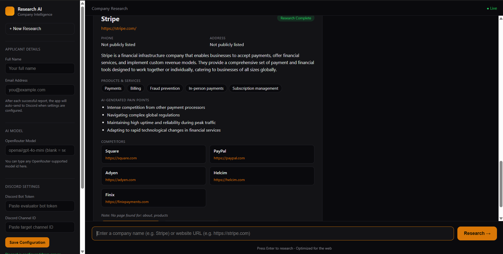
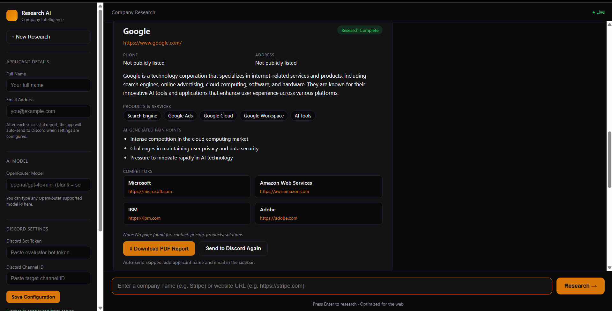
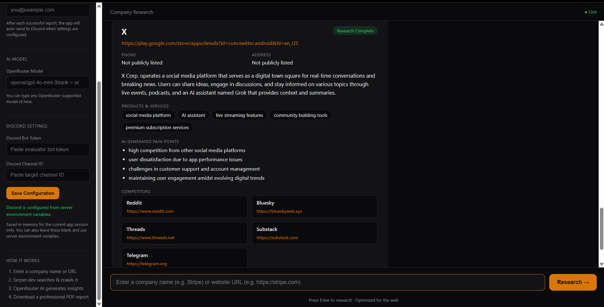

# Company Research AI

An AI-powered Company Research Assistant. Give it a company name or website
URL and it will search, crawl, analyze with AI, identify competitors, and
generate a downloadable PDF report — all through a ChatGPT-style interface.

Built for the Relu Consultancy AI & Automation Developer hackathon.

Live demo: https://company-research-ai-2101.onrender.com/

---

## Features

- Accepts either a **company name** (e.g. `Tesla`) or a **website URL** (e.g. `https://tesla.com`)
- Resolves company name → official website using **Serper.dev**
- Crawls the site (About, Products, Services, Solutions, Contact, Pricing pages),
  deduplicating and filtering out login/irrelevant pages
- Enriches research with additional Serper.dev searches (competitors, contact info,
  Google Knowledge Graph data)
- Sends assembled context to **OpenRouter** for AI analysis: summary, products/services,
  pain points, competitor suggestions, and a richer company profile — model is selectable in the UI
- Identifies competitors with a short rationale for why each one is relevant
- Shows source references used in the research, with weak sources filtered out
- Generates a professional, downloadable **PDF report**
- Clean, responsive, ChatGPT-style chat interface
- **Bonus:** Discord settings section — save a bot token + channel ID in the UI, then
  automatically send applicant details, company info, and the generated PDF after each
  successful report

---

## Screenshots

These are real outputs from the deployed app and are the best examples to include in the submission:







---

## Tech Stack

| Layer | Choice |
|---|---|
| Backend | Python, FastAPI (async) |
| Frontend | Vanilla HTML/CSS/JS served by FastAPI (no build step) |
| Crawling | `httpx` (async) + `selectolax` |
| PDF generation | `reportlab` |
| Search | Serper.dev |
| AI | OpenRouter |
| Discord | Discord Bot HTTP API (direct REST, no gateway process) |
| Deployment | Render |

See `DESIGN_DECISIONS.md` for the full reasoning behind each choice.

---

## Project Structure

```
company-research-ai/
├── app/
│   ├── main.py                    # FastAPI app entrypoint
│   ├── models.py                  # Pydantic schemas
│   ├── services/
│   │   ├── serper.py              # Serper.dev client
│   │   ├── openrouter.py          # OpenRouter AI client
│   │   ├── crawler.py             # Async website crawler
│   │   ├── pdf_generator.py       # PDF report builder
│   │   ├── discord_sender.py      # Discord bot sender
│   │   └── runtime_config.py      # In-memory Discord settings storage
│   └── routes/
│       ├── research.py            # POST /api/research
│       ├── pdf.py                 # POST /api/pdf
│       ├── discord.py             # POST /api/discord/send
│       └── settings.py            # GET/POST /api/settings/discord
├── templates/index.html           # Chat UI shell
├── static/style.css, app.js       # Styling + frontend logic
├── requirements.txt
├── .env.example                   # Example environment file
├── render.yaml                    # Render deployment blueprint
└── README.md
```

---

## Setup Instructions (Local)

1. **Clone the repo and enter it:**
   ```bash
   git clone <your-repo-url>
   cd company-research-ai
   ```

2. **Create a virtual environment and install dependencies:**
   ```bash
   python -m venv venv
   source venv/bin/activate   # Windows: venv\Scripts\activate
   pip install -r requirements.txt
   ```

3. **Create your `.env` file** (copy `.env.example` and fill in real values):
   ```bash
   cp .env.example .env
   ```
   See [Environment Variables](#environment-variables) below for what each key does.

4. **Run the app:**
   ```bash
   uvicorn app.main:app --reload
   ```

5. Open **http://localhost:8000** in your browser.

---

## Environment Variables

| Variable | Required | Description |
|---|---|---|
| `SERPER_API_KEY` | Yes | API key from [serper.dev](https://serper.dev) — used for search/research |
| `OPENROUTER_API_KEY` | Yes | API key from [openrouter.ai](https://openrouter.ai) — used for AI analysis |
| `OPENROUTER_DEFAULT_MODEL` | No | Default model id (e.g. `openai/gpt-4o-mini`). Falls back to this if the request doesn't specify one |
| `DISCORD_BOT_TOKEN` | No (bonus) | Optional server-side Discord bot token fallback |
| `DISCORD_CHANNEL_ID` | No (bonus) | Optional server-side Discord channel ID fallback |
| `CRAWLER_MAX_PAGES` | No | Max pages crawled per site (default `8`) |
| `CRAWLER_PAGE_TIMEOUT` | No | Timeout in seconds per page fetch (default `10`) |

Serper/OpenRouter keys are read **server-side only** from environment variables.
Discord can be configured in either of two ways:

- Save the Discord Bot Token and Channel ID in the UI settings section for the current app session.
- Set `DISCORD_BOT_TOKEN` and `DISCORD_CHANNEL_ID` on the server as a fallback/default.

If Discord is not configured, the app still runs normally and simply skips the auto-send step.

---

## API Endpoints

| Method | Path | Purpose |
|---|---|---|
| `GET` | `/` | Chat UI |
| `POST` | `/api/research` | Runs the full research pipeline for a company name/URL |
| `POST` | `/api/pdf` | Generates a PDF from an already-assembled research result |
| `POST` | `/api/discord/send` | Sends applicant details + report to Discord (if configured) |
| `GET` | `/api/settings/discord` | Reads Discord configuration status |
| `POST` | `/api/settings/discord` | Saves or clears Discord settings for the current app session |
| `GET` | `/api/health` | Liveness check for deployment platforms |

---

## Deployment (Render)

This repo includes a `render.yaml` blueprint.

1. Push this repo to GitHub (public, per submission requirements).
2. In Render, choose **New → Blueprint** and connect the repo.
3. Render will detect `render.yaml` and prompt you for the secret values
   (`SERPER_API_KEY`, `OPENROUTER_API_KEY`, and optionally the Discord vars).
4. Deploy. Render builds with `pip install -r requirements.txt` and starts with
   `uvicorn app.main:app --host 0.0.0.0 --port $PORT`.
5. Your public URL will be `https://<service-name>.onrender.com`.

---

## Known Limitations

- The crawler uses plain HTTP + HTML parsing (no headless browser), so JavaScript-
  rendered single-page-application sites may return limited content. This keeps
  crawling fast and dependency-light, which matters given the time constraints of
  the assignment; documented here rather than silently glossed over.
- The app filters out low-trust sources and weak competitor suggestions, but unusually branded products or sparse company sites can still produce less detailed output than ideal.
- No persistent storage/database, per the assignment's requirements — every
  research run is stateless and in-memory only.
- Discord settings saved through the UI are also in-memory only, so they reset when the app restarts.
- Progress indicators in the UI cycle through expected pipeline stages on a timer
  rather than streaming true real-time backend events (which would require
  websockets/SSE) — kept simple by design for this scope.

---

## Testing It

Try any of these in the chat input:
- `Stripe`
- `Tesla`
- `https://openai.com`
- `Microsoft`
